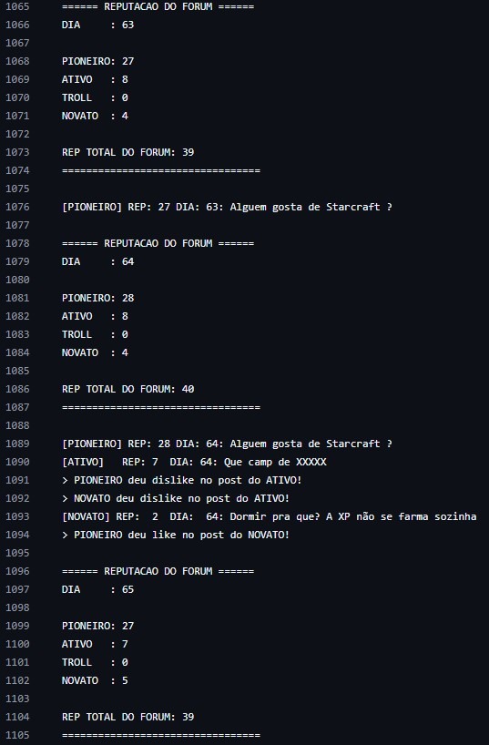
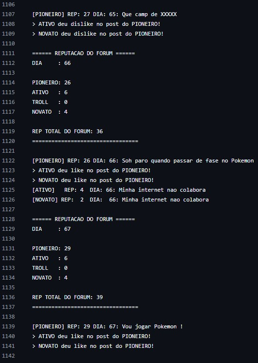
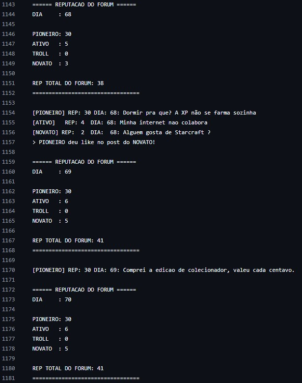
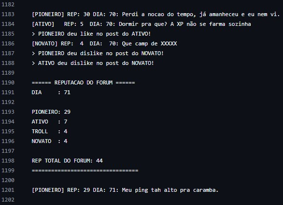
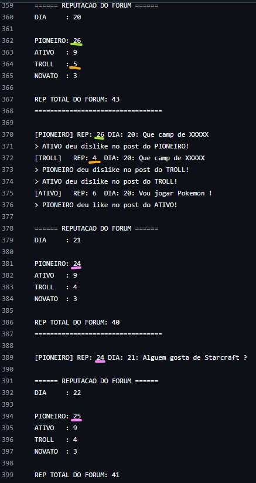
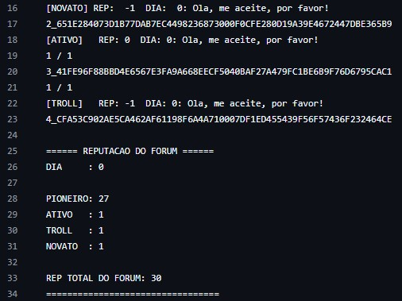
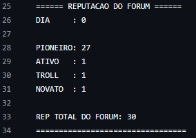
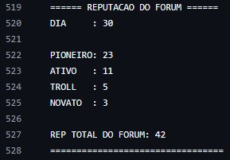
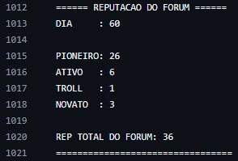
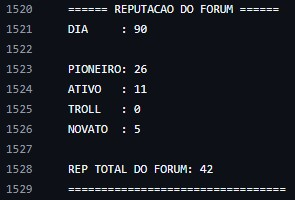

# Discussão
A simulação de 90 dias mostrou que um fórum descentralizado baseado em reputação pode se autorregular de forma eficiente. Para a simulação, quatro perfis foram criados com comportamentos distintos, com o objetivo de representar diferentes tipos de usuários reais.

* O Troll não foi tóxico desde o início. Nos primeiros dias, ele se comportou bem, postando mensagens adequadas e ganhando reputação, refletindo o comportamento comum de pessoas que "testam os limites" antes de se revelarem problemáticas. No segundo mês, ele passou a postar mais mensagens duvidosas, e no terceiro, totalmente impróprias. Como resultado, começou a receber mais dislikes e sua reputação caiu, reduzindo sua influência no fórum.

* O Pioneiro, como criador do fórum público, já começava com 30 de reputação e podia ser mais ativo na tentativa de engajar os demais membros.
  
* O Ativo manteve uma postura constante de colaboração, postando e reagindo aos posts sempre que conseguia reputação suficiente. Como gastava reputação com muita frequência, no entanto, chegou a ser sobrepujado pelo Troll em algumas simulações, pois o mesmo só dava dislike nas postagens.

* O Novato, inicialmente inseguro e com pouca participação, foi ganhando reputação aos poucos conforme postava no fórum. Após o terceiro mês, menos cauteloso, passou a postar com a frequência de um usuário Ativo, o que simulou o processo natural de integração de novos membros em comunidades online.

## Potenciais problemas encontrados

### Ganho repentino de reputação

Quando um usuário atinge reputação menor ou igual a 0, espera-se que ele não consiga mais realizar postagens. Da forma como o código foi escrito, esse usuário continua tentando postar mesmo com reputação insuficiente. Embora o esperado fosse que essas publicações ficassem simplesmente bloqueadas, `na quarta tentativa o usuário ganha +4 de reputação do nada`, sem interações envolvidas. *A reputação dos demais usuários não é afetada*.
Esse problema foi identificado em múltiplos testes e, embora o código da simulação esteja sujeito a ~~muitos~~ erros, nenhuma parte dele parece ser capaz de gerar esse tipo de comportamento.

Além da sobrevida inesperada ao usuário Troll quando ele já deveria ter sido neutralizado, não foi observado maiores impactos durante a simulação.

Observe no trecho abaixo que no dia 63 a reputação do Troll zerou. Nos dias 64, 66, 68 e 70 (dias pares) ele tentou postar sem sucesso (prints e reações só acontecem quando o bloco é identificado no heads). No dia 71, *o TROLL recebe um acréscimo de +4 de reputação* sem justificativa. A interação dos outros membros parece funcionar normalmente. 

Esse comportamento também foi observado com o ATIVO quando o mesmo teve a reputação zerada em algumas simulações. Sempre acontece após o usuário com reputação insuficiente tentar postar 4x sem sucesso.

### Pioneiro não perde reputação ao postar

Durante a simulação, observou-se que o `Pioneiro não perde reputação ao postar`.
A publicação certamente está sendo aceita nos heads, uma vez que os demais participantes estão reagindo a ela.
Além disso, embora postar não resulte em perda de reputação, o `Pioneiro passa a ganhar reputação após o período de 24 horas`. 

### Comportamento inconsistente na primeira postagem

Foi observado que, ao realizarem sua primeira publicação, a reputação de alguns usuários cai para -1 e outros para 0. No entanto, quando o Pioneiro reage com um like a essas postagens, a reputação de todos é ajustada para 1, independentemente do valor anterior.

# Conclusão
Apesar das inconsistências encontradas, o sistema de reputação funcionou bem como filtro social: usuários com bom comportamento ganharam influência (mais reputação) no fórum, enquanto usuários com atitudes tóxicas foram naturalmente rejeitados pelos demais participantes.

## Histórico de reputação do fórum:

