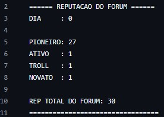
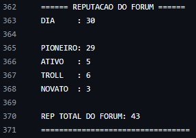
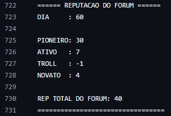

# Discussão
A simulação de 90 dias mostrou que um fórum descentralizado baseado em reputação pode se autorregular de forma eficiente. Para a simulação, quatro perfis foram criados com comportamentos distintos, com o objetivo de representar diferentes tipos de usuários reais.

* O Troll não foi tóxico desde o início. Nos primeiros dias, ele se comportou bem embora só desse dislike nos demais, postando mensagens adequadas e ganhando reputação no processo. Isso reflete o comportamento comum de pessoas que "testam os limites" antes de se revelarem problemáticas em vez de ser alguém que apenas entra em um ambiente para postar spam. No segundo mês, o Troll passou a postar mais mensagens duvidosas, e no terceiro, todas as suas publicações eram impróprias. Como resultado, começou a receber mais dislikes gradualmente e sua reputação zerou, sendo incapaz de publicar novamente.

* O Pioneiro, como criador do fórum público, já começava com 30 de reputação e pôde ser mais ativo na tentativa de engajar os demais membros curtindo e descurtindo posts com mais liberdade. Não houve variação significativa de reputação ao longo da simulação.
  
* O Ativo manteve uma postura constante de colaboração, postando e reagindo aos posts sempre que conseguia reputação suficiente. Como gastava reputação com muita frequência, no entanto, chegou a ser sobrepujado pelo Troll em algumas simulações, pois o mesmo só dava dislike nas postagens.

* O Novato, inicialmente inseguro e com pouca participação, foi ganhando reputação aos poucos conforme postava no fórum. Após o terceiro mês, menos cauteloso, passou a postar com a frequência de um usuário Ativo, o que simulou o processo natural de integração de novos membros em comunidades online.

# Resultados
O sistema de reputação funcionou conforme o esperado na regulação das mensagens: usuários com bom comportamento ganharam reputação gradualmente no fórum, enquanto o TROLL foi rejeitado pelos demais participantes e impedido de postar por não ter reputação suficiente.

## Histórico de reputação do fórum:

