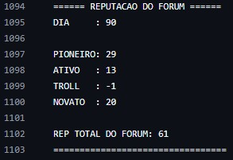

# Discussão
A simulação de 90 dias mostrou que um fórum descentralizado baseado em reputação pode se autorregular de forma eficiente. Para a simulação, quatro perfis foram criados com comportamentos distintos, com o objetivo de representar diferentes tipos de usuários reais.

* O Troll, por exemplo, não foi tóxico desde o início. Nos primeiros dias, ele se comportou bem, postando mensagens adequadas e ganhando reputação, refletindo o comportamento comum de pessoas que "testam os limites" antes de se revelarem problemáticas. No segundo mês, ele passou a postar mais mensagens duvidosas, e no terceiro, totalmente impróprias. Como resultado, começou a receber mais dislikes e sua reputação caiu, reduzindo sua influência no fórum.

* O Pioneiro, como criador do fórum público, já começava com 30 de reputação e podia ser mais ativo do que os demais membros. Já o Ativo manteve uma postura constante de colaboração, postando e reagindo aos posts sempre que conseguia reputação suficiente. Como gastava reputação com muita frequência, no entanto, chegou a ser sobrepujado pelo Troll em algumas simulações, pois o mesmo só dava dislike em suas postagens.

* O Novato, inicialmente inseguro e com pouca participação, foi ganhando reputação aos poucos conforme postava no fórum. Após o terceiro mês, menos cauteloso, passou a postar com a frequência de um usuário Ativo, avaliando o conteúdo dos outros, o que simulou o processo natural de integração de novos membros em comunidades online.

### Evolução do histórico de reputação:

# Conclusão
Portanto, a reputação funcionou como um filtro social eficaz: usuários com bom comportamento ganharam mais voz dentro do fórum, enquanto atitudes tóxicas foram naturalmente rejeitadas pelos demais participantes.
